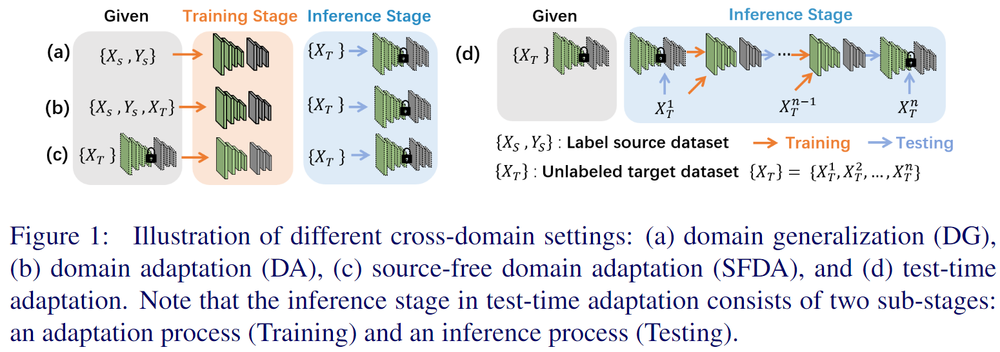
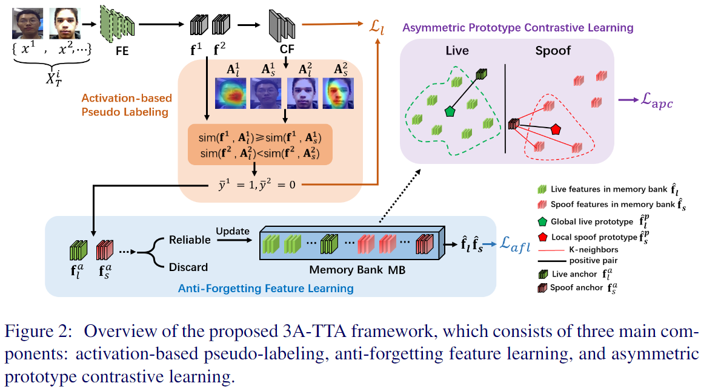
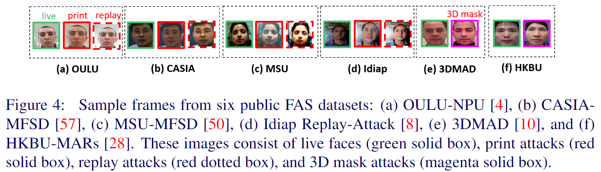
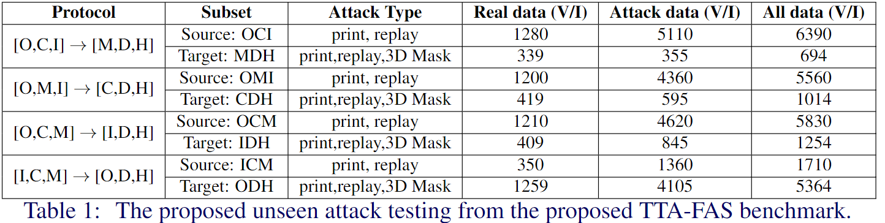
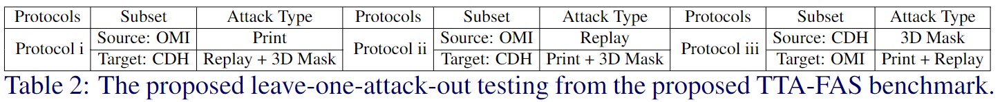
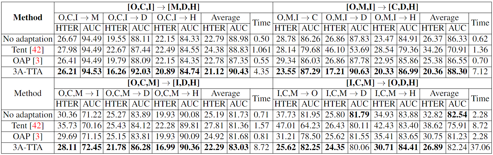
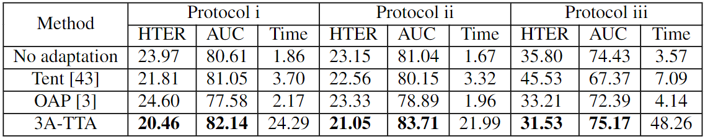

# TTA-FAS
### [Test-Time Adaptation for Robust Face Anti-Spoofing (BMVC'23)]()

(This is the first work focusing on addressing **fully** test-time adaptation for face anti-spoofing)
## Fully Test-time Setting 
 

## Network Architecture
 

## Proposed Protocol
(We propose the two new benchmarks TTA-FAS covering different domains and various attacks to simulate the real-world scenario.)


### Protocol 1


### Protocol 2


## Performance
### Protocol 1


### Protocol 2


## Citation

Please cite our paper using:

```
@article{
}
```

## Pretrained Weights
https://drive.google.com/drive/folders/14O3VgBhnEhnTSxsdMDPwc1xyFVTBVtRW?usp=drive_link
